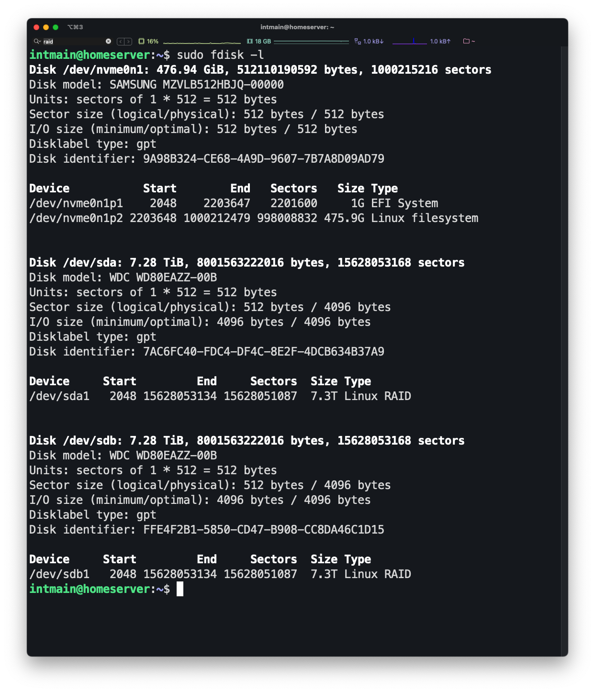

# 3. 레이드 설정

출처: [https://softtone-someday.tistory.com/4](https://softtone-someday.tistory.com/4)

- 하드디스크 포맷 및 세팅하기 - `fdisk` 로 설정
    
    ```bash
    sudo fdisk -l
    ```
    
    여기서 잡힌 디스크로 설정하기
    
    ```bash
    sudo fdisk /dev/sda
    ```
    
    `Command (m for help):` 뒤에 차례대로 입력 후 설정
    
    ```bash
    g # gpt 설정. 2tb 이상일 때
    
    n # new partition 생성
    
    p # primary type. 기본값으로 하기 때문에 엔터 치면서 넘어가기
    # enter: 파티션 번호
    # enter: 파티션 시작 위치
    # enter: 파티션 종료 위치. 파티션크기 설정시에 사용.
    
    t # 파티션 타입 설정
    
    29 # type을 1에서 29로 바꿈. Linux RAID로 바꿈
    
    p # 파티션 확인.
    
    w # 저장 및 종료
    ```
    
    결과물:
    
    
    
- `mdadm` 설치
    
    ```bash
    sudo apt install mdadm
    ```
    
- RAID1으로 디스크 2개 묶기
    
    ```bash
    # mdadm --create {장치명} --level={레이드 번호} --raid-device={구성할 파티션 개수} {구성 파티션 리스트} 
    # for raid 1 Example 
    mdadm --create /dev/md1 --level=1 --raid-device=2 /dev/sdb1 /dev/sdc1
    ```
    
- 레이드 되었는지 확인
    
    ```bash
    cat /proc/mdstat
    ```
    
- 레이드로 묶인 디스크 포맷
    
    ```bash
    sudo mkfs.ext4 /dev/md1
    ```
    
- 마운트 될 폴더 만들고 마운트 시키기
    
    ```bash
    # mkdir 폴더경로. 보통 /mnt/shared식임
    sudo mkdir /home/nas
    
    # mount 레이드 하드경로 만든폴더경로
    sudo mount /dev/md1 /home/nas
    ```
    
- 부팅시 자동 마운트 되도록 설정
    
    ```bash
    sudo mdadm --detail --scan | sudo tee -a /etc/mdadm/mdadm.conf 
    
    sudo update-initramfs -u 
    
    # echo '/dev/md1 [하드디스크 마운트 폴더 경로] ext4 defaults 0 0' | sudo tee \-a /etc/fstab
    echo '/dev/md1 /home/nas ext4 defaults 0 0' | sudo tee \-a /etc/fstab
    ```
