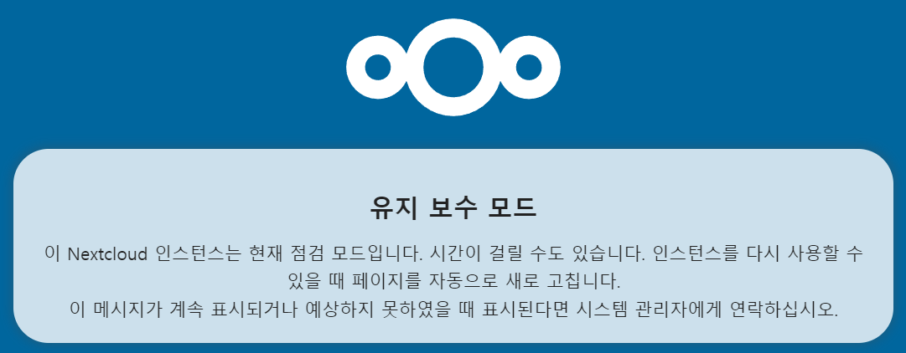
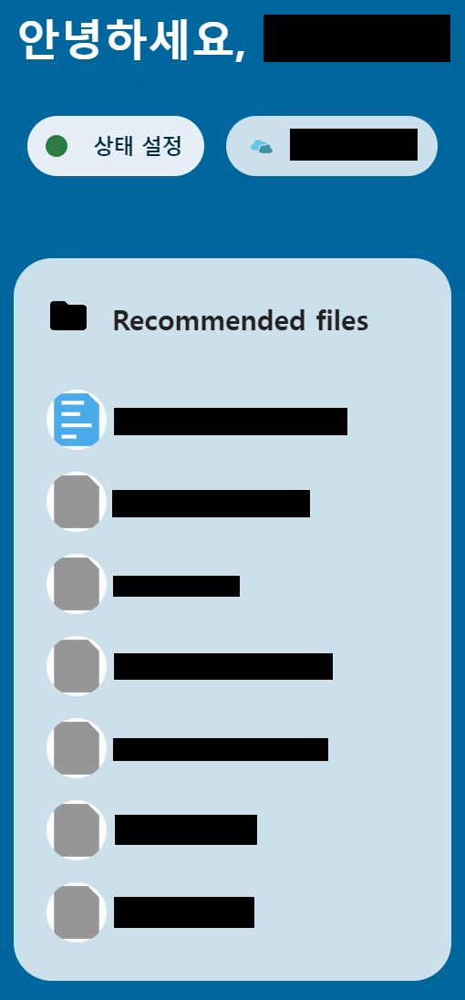

# Solve `Maintenance mode`

Suddenly I cannot access to my nextcloud server, Showing

`Maintenance mode`



If you installled nextcloud using `snap`, then this problem can be resolved with ease.

Just type below code: [src](https://help.nextcloud.com/t/solved-nextcloud-is-automatically-getting-into-maintenance-mode-since-yesterday/67992)

``` {bash}
  sudo nextcloud.occ maintenance:mode --off
```

Then you can freely access to your nextcloud server.


